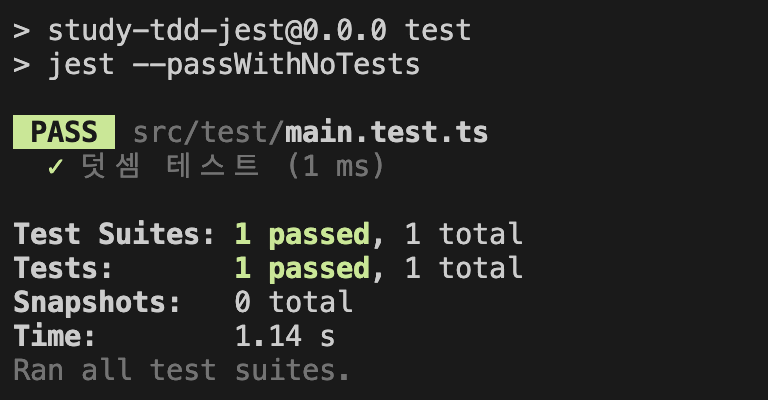

# study-tdd-jest

TDD(테스트 주도 개발)을 학습합니다.
Vite+React+TS 환경에서 Jest 테스팅 라이브러리를 사용합니다.

## 개요

### 🧐 TDD를 학습해야겠다고 생각한 이유

- 테스트 코드가 기존 동작에 대해서 안정성을 보장해 주니 새 기능을 추가하다 발생하는 사이드 이펙트 걱정을 덜 수 있다.
- 컴포넌트를 분리해야 하는 명확한 기준과 근거가 된다.
- 테스트 코드가 곧 명세가 되어버리니 따로 코드를 설명하기 위해 문서화 할 필요가 없어진다.

참조 : https://techblog.woowahan.com/8942/

### 🔧 TDD 개발 방법론의 프로그래밍 순서.

1. 실패하는 작은 단위 테스트를 작성한다. 처음에는 컴파일조차 되지 않을 수 있다.
2. 빨리 테스트를 통과하기 위해 프로덕션 코드를 작성한다. 이를 위해 정답이 아닌 가짜 구현 등을 작성할 수도 있다.
3. 그 다음의 테스트 코드를 작성한다. 실패 테스트가 없을 경우에만 성공 테스트를 작성한다.
4. 새로운 테스트를 통과하기 위해 프로덕션 코드를 추가 또는 수정한다.
5. 1~4단계를 반복하여 실패/성공의 모든 테스트 케이스를 작성한다.
6. 개발된 코드들에 대해 모든 중복을 제거하며 리팩토링한다.

출처: [https://mangkyu.tistory.com/182](https://mangkyu.tistory.com/182) [MangKyu's Diary:티스토리]

## 📚 학습할 순서

1. 기본사용법 익히기
2. 기존에 동작하는 코드의 테스트코드를 작성해보기
3. 테스트 코드를 먼저 짜고 코드로 구현해보기
4. [Vite에서 jest 사용하기](https://github.com/sodatea/vite-jest/tree/main/packages/vite-jest#limitations-and-differences-with-commonjs-tests)

## 시작하기

1. 프로젝트 생성 하기

```shell
npm create vite@latest [프로젝트 명] --template react-ts
```

2. 필요한 모듈 설치

```shell
npm i jest @types/jest ts-jest -D
```

3. 간단한 테스트 돌려보기

main.test.ts

```ts
test("덧셈 테스트", () => {
  const a = 1;
  const b = 2;
  expect(a + b).toBe(3);
});
```

package.json

```json
  "scripts": {
    ...
    "test": "jest --passWithNoTests"
    ...
  }
```

첫 실행에 테스트는 통과됐지만 아래와 같은 warning 메세지 발생.

> ts-jest[config] (WARN) message TS151001: If you have issues related to imports, you should consider setting `esModuleInterop` to `true` in your TypeScript configuration file (usually `tsconfig.json`). See https://blogs.msdn.microsoft.com/typescript/2018/01/31/announcing-typescript-2-7/#easier-ecmascript-module-interoperability for more information.

`tsconfig.json` 파일 `compilerOptions` 에 `"esModuleInterop": true,` 추가.

추가 후 warning 없이 정상 실행 됨



---

🔗 Typescript에서 jest 사용법 참고 : https://rutgo-letsgo.tistory.com/289
